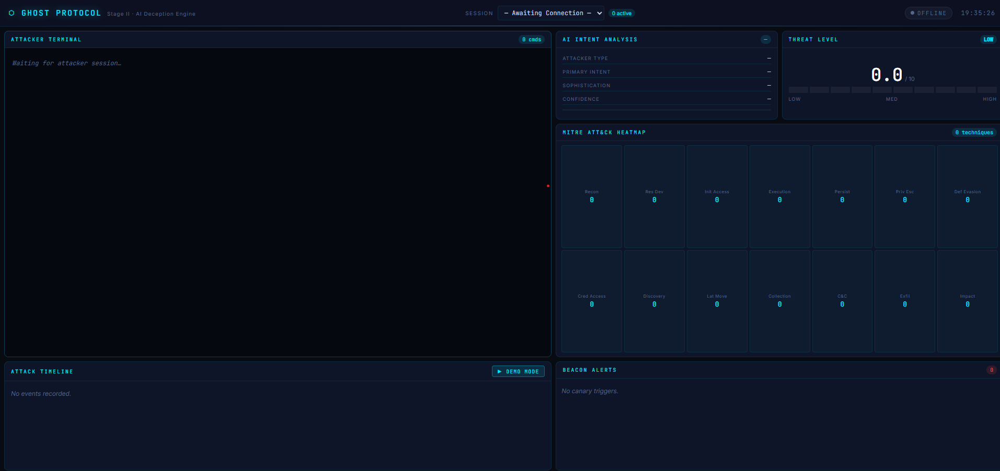

# 👻 Ghost Protocol — AI Deception & Attribution Engine

> An autonomous AI-driven cyber deception and attribution platform that transforms attacker intrusions into structured threat intelligence.

Ghost Protocol deploys a high-fidelity SSH deception environment that intercepts every attacker interaction and routes it through an AI inference pipeline. The system performs real-time behavioral profiling, maps observed techniques to the MITRE ATT&CK framework, dynamically shapes the fake environment to sustain engagement, and streams structured intelligence to a live analyst dashboard — all without exposing any real infrastructure.



---

## 🧠 Why Ghost Protocol?

Traditional intrusion detection and prevention systems are inherently reactive — they fire alerts after an attacker has already acted. Ghost Protocol takes a fundamentally different approach: rather than blocking or ignoring intrusion attempts, it harvests them as intelligence.

Every command an attacker executes is an inference opportunity. Ghost Protocol captures attacker intent, infers objectives, classifies behavior against MITRE ATT&CK, computes a dynamic threat score, and builds a structured attribution profile — in real time, per session.

The result is a shift from passive detection to active intelligence collection.

> **From intrusion detection → to intrusion intelligence.**

---

## ✨ Features

- 🪤 **SSH Deception Gateway** — listens on port 2222, accepts all credentials, logs attacker fingerprints and TTPs
- 🧠 **AI Reasoning Core** — local LLM (via Ollama) infers attacker intent at the command level
- 🗺️ **MITRE ATT&CK Mapping** — auto-classifies observed behavior to tactics and techniques
- 📊 **Threat Scoring** — dynamic, per-session risk score updated with every command
- 🎭 **Environment Shaping** — AI adapts the fake filesystem to maintain attacker engagement
- 🔦 **Canary Tokens** — planted credentials and URLs that beacon home when triggered
- 📡 **Live SOC Dashboard** — WebSocket-powered interface with session view, MITRE heatmap, and attack timeline
- 📋 **Attribution Reports** — structured attacker intelligence report generated per session

---

## 🏗️ Architecture

```
Attacker ──► SSH Gateway (port 2222)
                    │
                    ▼
           Session Manager ──► PostgreSQL
                    │
                    ▼
         Command Interceptor
                    │
                    ▼
          AI Reasoning Core (Ollama / Llama)
      ┌─────────────┼─────────────┐
  Intent Inf.  Env. Shaper  MITRE Mapper
  Threat Score  Resp. Gen.  Report Gen.
                    │
       ┌────────────┼────────────┐
 Response Renderer  Telemetry   Beacon Manager
       │               │               │
  Attacker        PostgreSQL     Dashboard API
```

---

## 📁 Project Structure

```
ghost_protocol/
├── gateway/          SSH server & auth handler
├── session/          Session manager & data model
├── sandbox/          Docker sandbox orchestrator
├── interception/     Command interceptor
├── ai_core/          AI reasoning core (intent, MITRE, threat, report…)
├── tracking/         Canary manager & beacon listener
├── telemetry/        Structured logger
├── database/         SQLAlchemy models & async engine
├── dashboard/
│   ├── backend/      FastAPI app, routes & WebSocket hub
│   └── frontend/     Vanilla JS/CSS live dashboard
├── config/           Pydantic settings
├── alembic/          Database migrations
├── docker-compose.yml
├── Dockerfile
└── requirements.txt
```

---

## 🚀 Quickstart

### Prerequisites

- [Docker Desktop](https://www.docker.com/products/docker-desktop/) (running)
- [Ollama](https://ollama.com) with a model pulled: `ollama pull llama3`
- Python 3.11+

### 1. Clone & configure

```bash
git clone https://github.com/your-org/ghost-protocol.git
cd ghost_protocol
cp .env.example .env
# Edit .env — set OLLAMA_MODEL to your pulled model (e.g. llama3)
```

### 2. Generate SSH host key

```bash
python -c "import asyncssh; asyncssh.generate_private_key('ssh-rsa').write_private_key('config/ssh_host_rsa_key')"
```

### 3. Start infrastructure

```bash
docker-compose up -d postgres redis
```

### 4. Install dependencies & migrate

```bash
python -m venv venv
venv\Scripts\activate        # Windows
# source venv/bin/activate   # macOS/Linux

pip install -r requirements.txt
alembic upgrade head
```

### 5. Run the stack

**Terminal 1 — Dashboard API:**
```bash
uvicorn dashboard.backend.main:app --host 0.0.0.0 --port 8000 --reload
```

**Terminal 2 — SSH Honeypot:**
```bash
python -m gateway.ssh_server
```

**Terminal 3 — Attack simulation:**
```bash
ssh -p 2222 root@localhost
# Enter any password. Run commands: ls, id, whoami, cat /etc/passwd
```

Open **http://localhost:8000** to access the live dashboard.  
API reference is available at **http://localhost:8000/docs**.

---

## ⚙️ Configuration

All settings are managed via `.env` (copied from `.env.example`):

| Variable | Default | Description |
|---|---|---|
| `OLLAMA_BASE_URL` | `http://localhost:11434/v1` | Local LLM inference endpoint |
| `OLLAMA_MODEL` | `llama3` | Model name (llama3, mistral, etc.) |
| `POSTGRES_HOST` | `localhost` | PostgreSQL host |
| `POSTGRES_PORT` | `5433` | PostgreSQL port (5433 avoids conflicts with local installs) |
| `SSH_PORT` | `2222` | Honeypot SSH listen port |
| `DASHBOARD_PORT` | `8000` | Dashboard API port |
| `BEACON_BASE_URL` | `http://localhost:8000/beacon` | Canary token callback base URL |

---

## 🔒 Security Notes

- No real commands are executed on the host system
- Docker sandboxes run with `--network none` and enforced resource limits
- All secrets and API keys are environment-variable only — never commit `.env`
- SSH host keys must not be committed to version control

---

## ⚠️ Project Scope

Ghost Protocol is a functional research prototype demonstrating AI-assisted cyber deception at the session level. The current implementation operates as a single-node deployment.

The following capabilities are outside the current scope and represent planned future work:

- Multi-node distributed deployment
- Horizontally scaled WebSocket hub (Redis pub/sub integration is architecturally prepared)
- Enterprise SIEM integration and alert forwarding
- Automated attacker re-engagement and dynamic lure generation at scale

---

## 👥 Credits

Built by **Team A.S.E.A**

---

<p align="center">
  <sub>Ghost Protocol — because the best defence is deception.</sub>
</p>
